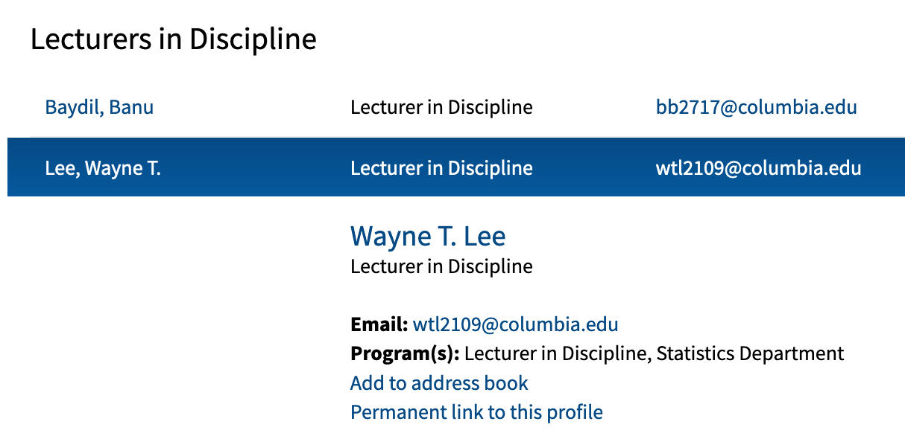
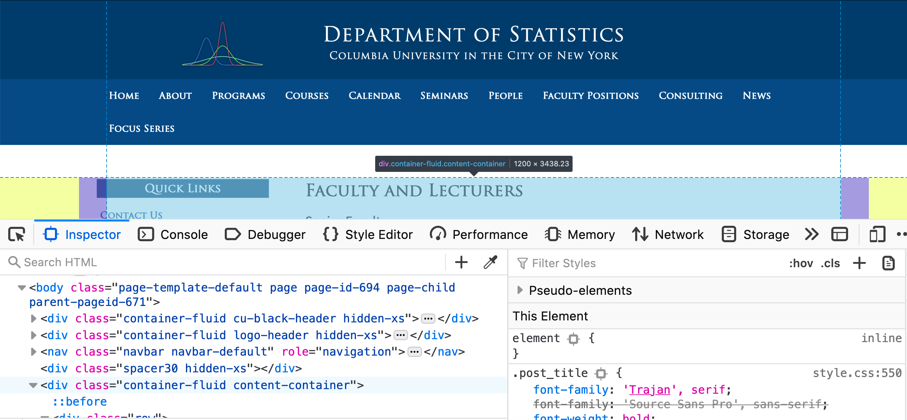
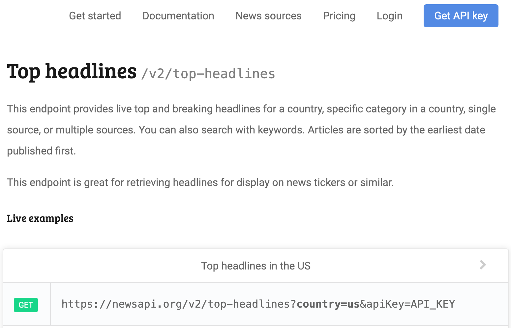

# Problem 6: Getting data
So far all the problems assumed that the data came from an existing file. But 
data can come directly from the internet without ever saving to a file.
In fact, this is the most common way how commercial venues exchange data.

In practice, there are 2 main ways to obtain data:
- Scrpaing data from a website
  - This is not recommended for reasons we will explain soon
- Calling the company's API (application programming interface)
  - This is the recommended route where agencies will provide some clear guidelines
    and filtering abilities.

#### Scraping a website
Most people are familiar with websites displaying information to them via their browser.
To extract the information directly off the webpage is the act of scraping.
We will only cover the most basic case where we parse the text information from the HTML information.

For an example, we're going to obtain all the [faculty's names from Columbia's Statistics department](http://stat.columbia.edu/department-directory/faculty-and-lecturers/).


Specifically, we will try to get the bolded name like "Wayne T. Lee" and not the
"Lee, Wayne T." that is in an awkward ordering.

#### Using the inspector tool
As of 2020, most browsers have an inspector tool:


The Safari "Develop" tab to show up by default, please Google how to get it to surface.

The inspector tool allows us to see what part of the code correspond to what part of the webpage.
Try moving the curosr around different parts under "inspector", you should see different
parts of the webpage being highlighted.


At this point, we normally want to click into the different `<div>` tags (in Firefox, there are 
dropdown arrows next to the `<div>` tags that hide the details within the tag) until we see only the
text of interest in highlighted. These tags similar to the comma in a CSV file where
they format the data so the browser knows how to display the content.


The information from the navigation will inform us how to write the code later.

#### A quick note about HTML format
In a loose sense, HTML is a data format for webpages (look up XML for the
more proper data format).

Here are a few quick facts you need to know
- Most values are enclosed by tags, here's an example using the `<p>` tag: `<p>Here is a paragraph</p>`
  - Notice how we need a closing tag like `</p>` 
  - In Columbia example, you'll see a lot of `<a>` tags for hyperlinks
- Different tags have different purposes, for more information see [here](https://www.w3schools.com/tags/ref_byfunc.asp).
- HTML in general is hierarchical like nested lists because the webpage has different sections and
  sub-sections.
- The tags also have attributes, notice the `name` in our Columbia example in
  `<a name="anchor-36">` is an attribute with a value set to `"anchor-36"`

#### Calling the webpage using R with `httr`
The HTML in the inspector tool can be obtained by using the `GET()` function
in the library `httr`.
```r
library(httr)
url <- "http://stat.columbia.edu/department-directory/faculty-and-lecturers/"
web_response <- GET(url=url)
class(web_response)
names(web_response)
web_response$url
web_response$date
web_response$status_code
```
What to notice?
- We used the URL for the website and passed it to the function `GET()`
- You need to run `library(httr)` before `GET()` will be available for use.
- The class of the output from `GET()` is not our usual data types.
  We will explore this later.
- Various information associated with the call is attached to the output
  - A `status_code` of 200 means the call was overall "successful", other codes
    are ways to inform you of the type of error that was made.
- If you peek at `web_response$content`, notice that it's in a weird format that you cannot read (encoded!)    

To get the same text you saw in the inspector tool, you need to use `content()`
to help convert the binary data into text.
```r
web_content <- content(web_response, as='text')
class(web_content)
substr(web_content, 1, 100)
length(web_content)
nchar(web_content)
```

#### Parsing the webpage using `xml2`
The converted text is extremely long despite being one single string. Its
format is HTML which is a close cousin to XML. Here we will need the package
`xml2` to help us parse this string.

```r
library(xml2)
html_tree <- read_html(web_content)
class(html_tree)
```
- Again we have a special class of data. The HTML data is often thought of
  as a "tree" or "graph" where the most outer layer is root node and you
  can dig into the child-nodes.

To get the names we will run the following:
```r
name_node <- xml_find_all(html_tree, xpath='//h3[@class="cn-entry-name"]')
length(name_node)
name_node[[1]]
```
- We used "xpath" to help us specify the nodes we want to find.
  "xpath" is a language to interact with xml data as regular expression is
  a language to interact with free text.
- `'//h3[@class="cn-entry-name"]'` says that we want all the `<h3>` tags
  where their attribute `class` is being assigned to `"cn-entry-name"`.
  If you look back at our [screen shot when navigating the inspector](#using-the-inspector-tool)
  You'll notice that the names are within the `<h3>` tag with certain attributes.
- Notice we did not use the `<a>` tag as our search because its attribute had
  faculty's name in it which was what we were trying to find.

To complete the task:
```r
name_link_node <- xml_children(name_node)
length(name_link_node[[1]])
all_names <- xml_text(name_link_node)
class(all_names)
all_names
```
- To get the names, notice how there are 2 `<a>` tags are within the `<h3>` tags, so
  we need the "children" of these tags, so we use `xml_children()`
- Afterwards, we only want the text, not the information from the tag so we use `xml_text()`
- The final output is back to data types we are familiar with so we can use our
  methods above to handle these characters.

Side comment: scraping takes a lot of trial-and-error, do not worry if this
took awhile to do!

[Exercise](../exercises/r_scraping.md)

#### From the special classes in httr and xml2 to our native R data types
Special data types are common in object oriented programming languages (which R supports)
so sometimes you'll see odd data types pop up.

These are created often to facilitate
operations specific to the type of data at hand (e.g. parsing responses from websites,
navigating XML graphs). Packages/libraries will often have custom functions that interact
with these special data types (e.g. content(), xml_children(), etc).

My general recommendation is to:
- Find the examples in the documentation to leverage these custom functions
  - Sometimes you'll have to Google for examples/tutorials. Generally popular libraries
    will have plenty of tutorials available online. This is a reason to use libraries
    that are well-known even if you may not like how they're coded up.
- Try to output the necessary information into a native R data type (e.g. numeric, lists, character, etc)
  that you are familiar with so you regain control over the data.

Side comment: custom data types and functions are common in something called
"object oriented programming" (OOP) as opposed to function programming (where
the data types are limited but the number of functions is vast). You should take
a CS course if you're curious about these 2 philosophies.

#### The "Network" under Inspector and why scraping is discouraged
Return to the Inspector Tool, you should see a tab called "Network".
- Click on the "Network" tab
- Refresh the [faculty page](http://stat.columbia.edu/department-directory/faculty-and-lecturers/)
- Notice the activities triggered from loading a single page!
  - Each of these line items is a "call" (e.g. how we ran `GET()` above is a single call) to somewhere on the internet
  - You should see the time to finish each task, the size of data, and the "type" of data passing between your browser and the web


Take-home messages:
- When you load a website, a lot of activity is triggered so scraping is very resource intensive
- You are often unaware of what is being sent to/from these APIs that are being called (this is
  how Ads track you)
  - If you click around, you'll notice that your browser, type of OS you're using, your language preference
    and sometimes your general location information is being sent.
- Notice how images take up a lot of bandwidth (knowing this will help you be careful when dealing with
  image data)

#### Some context on APIs
Here are some of the flaws of scraping:
- From the company's perspective, you scraping their website is wasteful to them.
- To us, scraping the data from their website is extremely unreliable (there are ways to make it
  much harder) because a simple change on the website will break our entire scraping algorithm (bad for automation).
  Also, the data may not be the data we want (imagine trying to get historical faculty members).

One way to solve this, is to leverage the company's APIs:
- API stands for **a**pplication **p**rogramming **i**nterface, it's something you can write code
  against (programming interface) so you can interact with the company's application.
  - What does "write code against" mean?
    - APIs are often provided with certain guarantees like "the data will be returned as a JSON with
      with certain attributes". So even if the company changes their website, the APIs will often
      behave the same way so automated pipelines that rely on these data sources will not crash.
  - What do you mean by the company's application?
    - Turns out a single website often has several different teams managing different features/applications.
      For example, on the homepage of LinkedIn, you can see news team, jobs, and posts from your your connections.
      The content for each category is actually created by different teams and one team then decides what/when
      to display to you when you login. The key is that different features/applications would then
      have access to different types of information/data and would naturally support different APIs.

#### Elements in an API call
Calling an API can be done via the `GET()` function as in scraping!
The common difference is that we will often pass multiple arguments along with our call
to specify who we are and what we want.

As an example, we will use the [newsapi.org](https://newsapi.org) as an example.
This is a website that aggregates different headlines from different papers. It gives you
a few "free" calls but will block you after a certain threshold (freemium business model).

If you look at the documentation for [NewsAPI.org](https://newsapi.org/docs), there are 3 different
urls, under "Endpoints", for 3 different applications: top headlines, everything, and
sources. If you click on "Top headlines", you'll see a link, `https://newsapi.org/v2/top-headlines?country=us&apiKey=API_KEY`
after the word "GET".


On the page above, the elements to make an API call are:
- The **url**: this is similar to the URL for your browser.
  - For our example it's the `https://newsapi.org/v2/top-headlines` which is everything before the `?`
- Parameters: these are like arguments to a function
  - From the example, the parameters can be spotted after the `?`
  - For our example, it seems like we can specify an argument named `country` and one possible value is `us`
  - You can find more arguments under "Request parameters" to see the names and the possible values.
- Credentials:
  - Notice one of the parameters is `apiKey` that is required yet its value is not provided. This
    will contain the credentials that are unique to you. You'll need to apply for these by following the
    instructions on the right top corner.
  - This application process is unique to each company. Twitter's process can go up to 2 weeks, we have chosen
    one that can be provided instantly.
  - Some government agencies will not require you to apply for credentials.

#### Using `httr` to call the APIs
Now we know the elements, we will use `httr` to get the data similar to the example shown on
the [NewsAPI.org Top Headline endpoint](https://newsapi.org/docs/endpoints/top-headlines)

```r
library(httr)
url <- "https://newsapi.org/v2/top-headlines"
params <- list(
    country="us",
    apiKey="THE_KEY_YOU_GET")
response <- GET(url=url,
                query=params)
response$url
response$status_code

newsapi_data <- content(response)
class(newsapi_data)
names(newsapi_data)
```
What to notice?
- We passed the url to the `url` argument in `GET()`
- All other parameters, including the credential was passed to the argument `query` in `GET()` as a list.
  - The names used in the list are according to the parameters accepted by NewsAPI.org.
  - Notice that we did **NOT** pass `country` and `apiKey` to `GET()` directly because these arguments
    are specified by NewsAPI.org, not `GET()`
- Your status code should be 200 if you provided the correct credentials and everything.
- Notice that the `url` in `response` was now formatted as shown in the documentation for us.
  - It is important that you let `GET()` handle the formatting because symbols like " " or "!"
    need to be encoded differently. Your code is also easier to read this way.
- The final data should be a list that you know how to wrangle into a format that's easy to analyze.

#### Common errors in calling APIs
- A `non-200` status code. This often will have an informative error message. Try providing
  wrong credentials and see what happens.
- Passing the arguments meant for the API to the `GET()` function instead. For example:
  ```r
  # Bad
  GET(url=url, country="us", apiKey="YOUR_KEY")
  # correct
  GET(url=url, query=list(country="us", apiKey="YOUR_KEY"))
  ```
- Spelling mistakes in the argument, try passing `APIKEY` instead of `apiKey` above, APIs
  tend to be case sensitive.
- Hitting your cap or not following the rules specified by the company. The APIs require
  servers to be running in the backend which cost money.
  Companies will often restrict the maximum number of calls you can perform for free. Reading
  the error message will help you resolve this.
- Using the wrong url. Try adding a typo, see what error surfaces!
- Some places have firewalls that prevent you from accessing some APIs, this is complicated...

#### Wrapping up
Hopefully you see how you could get more data from different websites in a programmatic fashion,
i.e. not clicking on Donwload manually.

I recommend you to try getting data via different APIs from different
companies. Here are a few places to start:
- [Free tweets](https://developer.twitter.com/en/docs/tweets/search/api-reference/get-search-tweets)
- [311 Service Data from NYC](https://nycopendata.socrata.com/Social-Services/311-Service-Requests-from-2010-to-Present/erm2-nwe9)
- [Stock data](https://www.alphavantage.co/documentation/)
- [US harvest and planting data](https://quickstats.nass.usda.gov/api)


