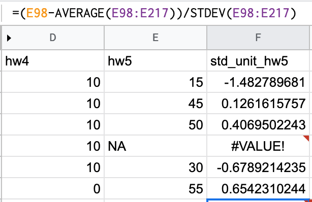

# Functions and data in R

#### Statistical Computing
- Giving a sequence of instructions to a computer
- Often each instruction involves an action (function) and an object (data)

#### Functions and data
A simple function common in calculators and programming languages
```r
log(10, base=10)
```

- function name:
- required function arguments (required data)
- how you pass the arguments (data) to the function
- optional function arguments (optional data)

#### Get the documentation of a function via `?FUN`
```r
?log
?"+"
```
- Arguments
- Output
- Examples
- Might work on different data types
  ```r
  1 + 1
  TRUE + FALSE
  ```

#### Error messages from functions
```r
log(-2)
log("2")
```
- Errors vs warnings
- Always read the error message
- Always check your understanding of the function against the documentation

IMPORTANT: Just because there is no error message does not mean your code is correct!

#### Practice
```r
a <- "this is a string"
1 + 2
sin(180)
```
- function name:
- required function arguments (required data)
- how you pass the arguments (data) to the function
- optional function arguments (optional data)


#### Basic data types - Overview
- numeric (Continuous or discrete)
- character
- factor (Categorical)
- boolean (TRUE/FALSE)
- functions
- Not Available (NA)

#### Basic data type - numerics
Most quantitative data.
```r
num_demo <- 1.2
class(num_demo)
num_demo + 2

tval <- 1.96
3 - tval * num_demo
# Guess the output!
(3 - tval) * num_demo
```

#### Basic data type - characters
Text data like news.
```r
char_demo <- "All is well! Missiles launched from Iran ..."
class(char_demo)
# [1] "character"

grepl("Iran", char_demo)
[1] TRUE
```

- How would you split the string by white spaces?

#### Basic data type - factors
Categorical data like membership to a group, e.g. male/female.
Useful for creating box-plots or splitting the data.
```r
fac_demo <- factor("male", levels=c("male", "female"))
class(fac_demo)
# [1] "factor"
fac_demo
# [1] male
# Levels: male female
```

In some programming languages, this is called **enum**

#### Basic data type - booleans
TRUE/FALSE, usually intermediate data to filter data or control the program, e.g. if the data point is an outlier, remove it.

```r
bool_demo1 <- 1 > 2
bool_demo2 <- TRUE
class(bool_demo1)
# [1] "logical"

bool_demo1
# FALSE
bool_demo2
# TRUE
!bool_demo2

bool_demo1 + bool_demo2
bool_demo1 & bool_demo2
bool_demo1 | bool_demo2
# Guess!
```

IMPORTANT: in general arithmatic with booleans treat
- TRUE as 1
- FALSE as 0

#### Basic data type - functions
Functions can also be considered to be a type of data. Often passed to create other functions.
```r
class(sin)
sin(180)
sin_deg <- function(deg){
    return(sin(deg / 180 * pi))
}
sin_deg(180)
```

#### Basic data type - Not Available (NA)
The main value for **missing data**
```r
na_demo <- NA
na_demo + 1
paste0(na_demo, "One")
class(na_demo)
```

#### How to deal with missing values depends on the problem
Example: 
Term Frequency Matrix (rows are different documents and columns are words)


Example: Calculating grade averages



#### Example - figuring out the data type of a variable
```r
var1 <- "1"
class(var1)
```

#### Example - converting between data types
```r
var1 <- "1"
var1_num <- as.numeric(var1)
class(var1_num)
```

But this doesn't always work
```r
var1 <- "a"
as.numeric(var1)
```

#### Example - R has a lot of built-in mathematical operations by default

Just like a normal calculator
```r
log(1)
sin(pi)
```

This is not true for Python


#### Why care about data types - constraint from data types will constrain the error
```r
var1 <- "1"
var2 <- 2
var1 + var2
# Error in var1 + var2 : non-numeric argument to binary operator
```

#### Common errors - "non-numeric argument to binary operator"
- Binary operators are functions that take in 2 inputs, one each from its left and right: e.g. `"*", "+", ">"`

Try out the following: the behavior may not be what you expect!
```r
1 * "12"
"a" > "A"
2 - TRUE
TRUE * FALSE
FALSE + FALSE
FALSE - TRUE
TRUE > FALSE
```

#### Common misunderstandings - truncation in R output vs numerical stability
Rounding example:
```r
(1e-7 + 10) * 1e7
(1e-7 + 10) * 1e7 - 1e8
```

Numerical stability example:
```r
1e-20 + 1e-8 - 1e-8
1e-20 * 1e-10
1e-20 * 1e-10 + 1e-8 - 1e-8
```

#### Key message:
- Computers are not perfect, different computers are also different. This is why people ask for your computer specifications when you report issues.
- This explains why we perform certain operations on data even though it does not change the problem mathematically, e.g. maximizing log(P(X)) vs maximizing P(X)
