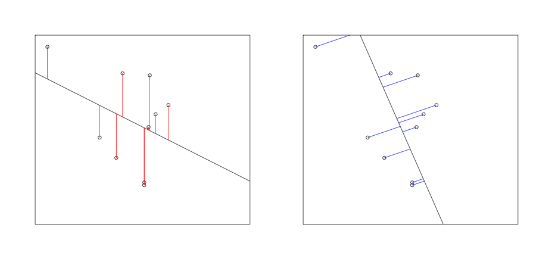
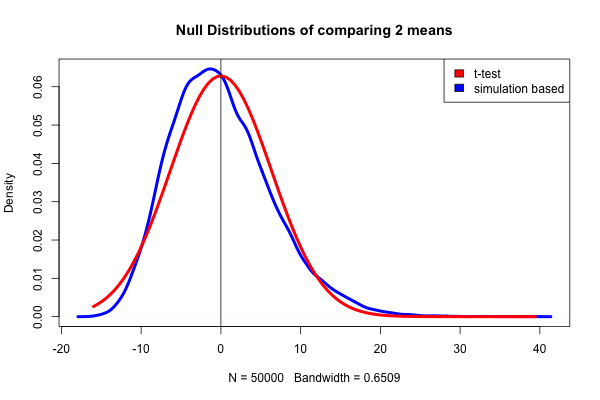
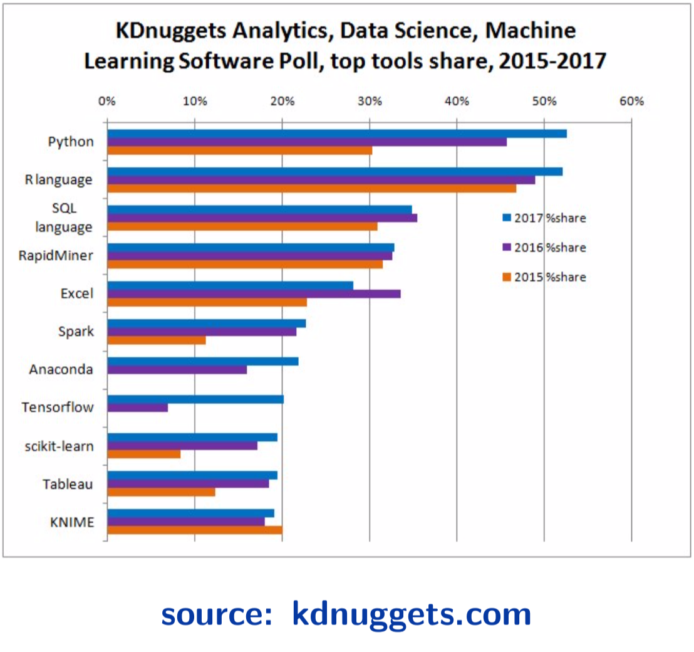

# Applied Statistical Computing

#### Learning objectives
- Develop the mindset of working backwards from given specifications
- Feel comfortable manipulating non-table-like data
- Understand the strengths of programming over Excel/Calculators
- Be able to simulate classic statistics

#### Expectations
- On Canvas, read it, it can be updated
- Example in-class survey on Canvas
- Homework 1 will be out on Ed

#### How to be successful in this class?
- Always have an expectation, then validate it
  - Run the examples and try to break it
  ```
  evens_example <- c(2, 4, 6)

  # Try things out!
  more_evens <- c(2, 4, 6, 8)
  evens_no_comma <- c(2 4 6)
  ```
- Ask questions online with clear attempts at the problem
  - Bad example
    ```
    I tried to derive the sum of the shortest distance
    function but it seems impossible to do it. (What did
    I do wrong?)
    ```
- Google can be your best friend

#### Why computing? - Efficiency


Thanks to Prof Thibault Vatter for this slide.

#### Why statistical computing? - Simulations can help validate theoretical results
  - Monte Hall problem
  
  - Fitting models when the assumptions are violated
  

#### Why statistical computing? - Simulations allow more diverse approaches
  - Permutation test instead of 2 sample t-test: no longer **as dependent** on Normal distribution
  

#### Why statistical computing? - Programming can handle big data
  - Wine Reviews from [Kaggle](https://www.kaggle.com/zynicide/wine-reviews)
  


#### Why statistical computing? - Lots of data are in non-tabular formats
JSON data from Indeed.com
```
{"request_params":
    {"jt": "fulltime",
     "q": "data",
     "l": "New York State",
     "start": 10},
 "job_descriptions":
    ["Description: This position ...",
     "At Noom, we use scientifically proven...",
     ...,
     "The NYC Department of Environmental Protection (DEP)..."]
 }
```

#### Why statistical computing? - Readable code
Normalizing data
- Using code
  ```
  std_unit_data <- (data - mean(data)) / sd(data)

  max_range <- max(data) - min(data)
  frac_data <- (data - min(data)) / max_range
  ```
- Using spreadsheets
  

#### Why statistical computing? - Reproducible research
- Using code to clean data - original data is not perturbed!
  ```
  large_dev <- 3 * sd(data)
  outliers <- abs(data - mean(data)) > large_dev
  clean_data <- data[!outlier]
  ```
- Using spreadsheets to clean data - how would you do it?
  

#### Why R? It's popular


Thanks to Prof Thibault Vatter for this slide.
