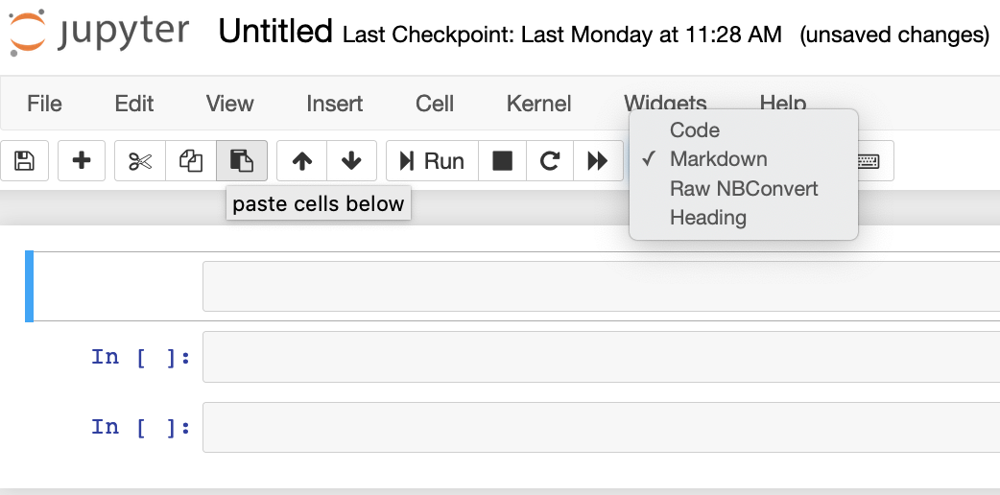
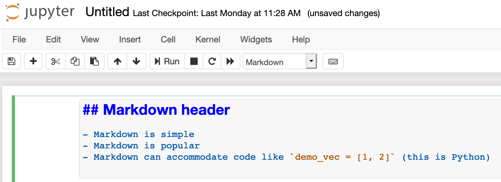
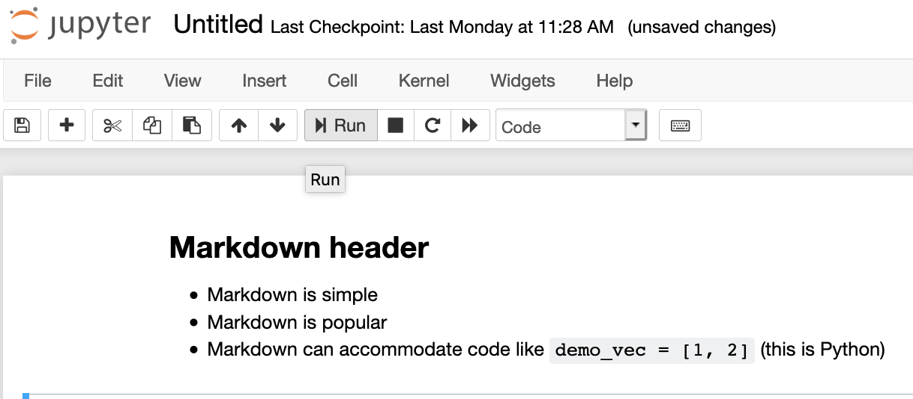
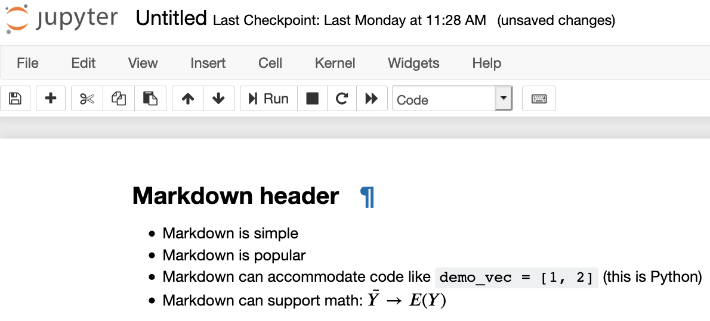

# Typesetting equations and code with Jupyter Notebooks

## Jupyter Notebook

In your typical Jupyter Notebook, there are different cells. All cells
default to "Code" cells but you can type math or text into a "Markdown"
cell. To change this, simply use the downdown menu as shown below. 

Once the cell is a Markdown cell. You can enter [Markdown](https://commonmark.org/help/)
which is a very common/simple way to format text for online materials.

Here's what typing in Markdown looks like:

If you run the code, it'll look like this:

You also enter mathematical equations using [LaTeX](https://en.wikipedia.org/wiki/Wikipedia:LaTeX_symbols)
by surrounding the commands with the dollar sign symbol `$`. LaTeX is one
of the most popular ways to typeset mathematical equations. Please see
the example below:

You can mix the mathematical equation within the Markdown

If you run the code, it'll look like this:

Note that the other cells still default to code:

To export the file as a PDF, you can simply download it as a PDF

