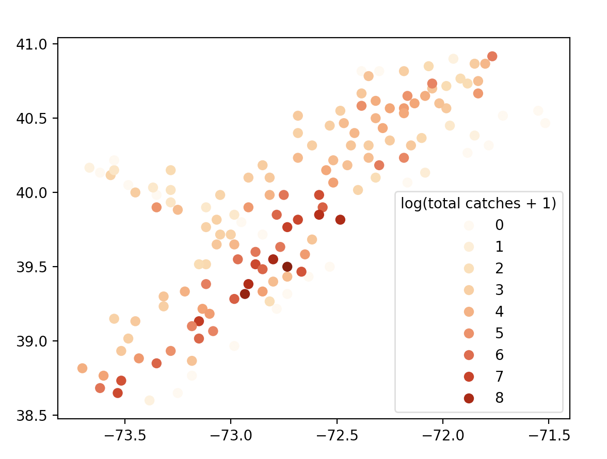

# Writing math and code in the same document

To make research reproducible, it's often best to be able to write and code
on the same document.

There are 2 platforms to achieve this (tutorials linked below), both can export
PDF files for submissions. Jupyter notebooks are slightly more flexible because
it supports Python as well.
- [Jupyter Notebooks](jupyter_typeset_pdf.md)
- [RMarkdown](rmd_typeset_pdf.md)

Both platforms leverage the syntax for [Markdown](https://commonmark.org/help/) (for writing formatting text, e.g. headers, bullet points, etc) and[LaTeX](https://en.wikipedia.org/wiki/Wikipedia:LaTeX_symbols) (for typesetting mathematical equations). We provide a cheat sheet below for common usecases.

## LaTeX cheatsheet
- To type out mathematical equations like: $$Y_{i} = \sum_{j=1}^n x_{i, j}\beta_j + \epsilon_i$$, just type
  ```
  $$Y_{i} = \sum_{j=1}^n x_{i, j}\beta_j + \epsilon_i$$
  ```
  - The double dollar sign `$` is specific to GitHub pages, telling it that everything in between should be parsed as LaTeX code. Some platforms only require single dollar signs and some platforms do not require a dollar sign if you can enter a LaTeX mode.
  - Notice that subscripts happen after an underscore `_`. If the subscript only contains one character, then
    you do not need to to use the curly brackets `{}` to surround.
  - Superscript happen after a carrot character `^`, similar rules as subscripts apply.
  - Special characters like greek letters are always prefixed by the backslash character `\` followed by a key word.
- To modify variables with symbols or type out fractions like: $$\bar{Y} = \frac{1}{n}\sum_i^n Y_i$$, just type
  ```
  $$\bar{Y} = \frac{1}{n}\sum_i^n Y_i$$
  ```
  - Notice how the `\bar{}` modifies the `Y` by adding a bar on top of it.
  - `\frac{}{}` behaves like a function with 2 inputs, the first for the numerator and the second for the denominator.
- To type out distributional assumptions like $$\binom{y_1}{y_2} \sim MVN\left( \binom{\mu_1}{\mu_2}, \begin{bmatrix} \sigma_1^2 & \sigma_{1, 2}\\ \sigma_{2, 1} & \sigma_2^2 \end{bmatrix} \right)$$
  ```
  $$\binom{y_1}{y_2} \sim MVN\left( \binom{\mu_1}{\mu_2}, \begin{bmatrix} \sigma_1^2 & \sigma_{1, 2}\\ \sigma_{2, 1} & \sigma_2^2 \end{bmatrix} \right)$$
  ```
  - I encourage you to break this code a bit to see what each function does, e.g. remove `\left` and `\right` and see its impact.
  - I'm hacking the `\binom{}{}` function to create a matrix-like value without typing out the syntax for the matrix
  - Notice the matrix format requires you to enter a different mode by using the `\begin{bmatrix}` and `\end{bmatrix}` key words.
    - Matrices in general are entered by "row", so different elements are separated by `&` and new rows are created using a double backslash `\\`


## Markdown cheatsheet
- Example, this page is written using Markdown.
- For different headers, you can prefix your line with different number of `#` signs, the fewer `#`, the larger the header. To type out the following:
    - # Hello
    - ## Beautiful
    - ### World
    You can type in:

    ```
    # Hello
    ## Beautiful
    ### World
    ```
- For stacked bullet points, you only need to add `-` with the appropriate indentation.
  - This is the first bullet
    - second bullet
      - third bullet

  ```
  - This is the first bullet
    - second bullet
      - third bullet
  ```
- To insert tables

  |column 1| data | notes|
  |--------|------|------|
  |columbia|2|US news|
  |harvard|1|US news|

  ```
  |column 1| data | notes|
  |--------|------|------|
  |columbia|2|US news|
  |harvard|1|US news|
  ```
- To insert an image
  
  ```
  
  ```
- To bold text
  You **shouldn't** be using this in a write-up but fine in a discussion thread.
  ```
  You **shouldn't** be using this in a write-up but fine in a discussion thread.
  ```


